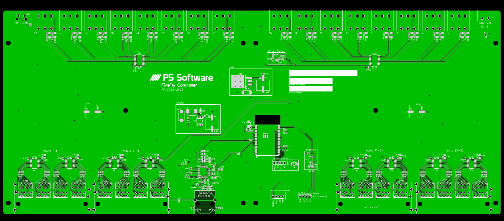
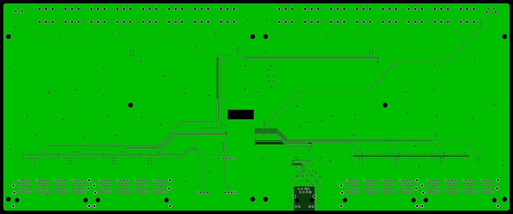

# FFC3232-2603

## Description
This controller model was the final test bed for software development and manufacturing.

**Status:** Manufactured, Unreleased

**Hex:** `0x32322603`

**Number of Inputs:** 32

**Number of Outputs:** 32

**Form Factor:** Rack Mount

## Power Input
- Minimum: 7VDC
- Recommended: 12VDC 6A
- Maximum: 26VDC

::: warning Minimum Amperage Changed
The minimum power supply amperage changed to 6A with this version due to elimination of the 9VDC power system.  Clients connected are now fed power directly from the power supply.
:::

## MCU
Espressif Systems ESP32-WROVER-E-N16R8 with 16MB Flash Storage.

## I2C Addresses

| Address | Usage | Notes |
| ------- | ----- | ----- |
| 0x20    | Input Ports 1-4 | |
| 0x21    | Input Ports 5-8 | |
| 0x22    | Input Ports 9-12 | |
| 0x23    | Input Ports 13-16 | |
| 0x24    | Input Ports 17-20 | |
| 0x25    | Input Ports 21-24 | |
| 0x26    | Input Ports 25-28 | |
| 0x27    | Input Ports 29-32 | |
| 0x40    | Output Ports 1-16 | |
| 0x41    | Output Ports 17-32 | |
| 0x70    | Output All-Call | Not used |
| 0x48    | Temperature Sensor | |
| 0x3C    | OLED Display | Variable, check display configuration |

## Inputs

This model features 4 banks of 8-RJ45 connectors without LEDs.

| Pin | Wire Color | Usage |
| --- | ---------- | ----- |
| 1 | White/Orange | Channel 1 |
| 2 | Orange | Channel 2 |
| 3 | White/Green | Channel 3 |
| 4 | Blue | +12VDC |
| 5 | White/Blue | +12VDC |
| 6 | Green | Channel 4 |
| 7 | White/Brown | Ground |
| 8 | Brown | Ground |

::: warning Power Output Voltage Changed
Clients connected are now fed power directly from the 12V power supply.
:::

## Outputs

This model features 16 double-stack 90 degree 5.08mm pluggable terminal block.

| Pin | Wire Color | Meaning |
| --- | ---------- | ------- |
| V   | Red | Variable (0-5VDC) |
| + | Green | Constant (12VDC) |
| - | Black | Ground |

::: warning Constant Power Output Voltage Changed
Output power is now fed power directly from the 12V power supply.
:::

## Network

Network connectivity is via Ethernet using a W5500 chipset featuring an RJ45 connector with status LEDs.

## Bill of Materials
The device's bill of materials is below, with links to the data sheets for each component.

| Name | Designator | Quantity | Manufacturer Part | Manufacturer | Supplier | Supplier Part |
| -- | -- | -- | -- | -- | -- | -- |
| 100uF | C1–C32 | 32 | GRM31CR61A107MEA8L | muRata(村田) | LCSC | [C883598](../datasheets/C883598.pdf) |
| 330uF | C33 | 1 | 6TPE330MAP | PANASONIC(松下) | LCSC | [C79112](../datasheets/C79112.pdf) |
| 1uF | C34, C41 | 2 | CL05A105KA5NQNC | SAMSUNG | LCSC | [C52923](../datasheets/C52923.pdf) |
| 470uF | C35, C36, C39, C98 | 4 | VEJ471M1ETR-1010 | LELON | LCSC | [C176672](../datasheets/C176672.pdf) |
| 1nF | C43, C57 | 2 | 0402B102K500NT | FH | LCSC | [C1523](../datasheets/C1523.pdf) |
| 100nF | C44, C46, C47, C48, C49, C50, C51, C54, C62, C63, C79, C82, C84, C85, C87, C89, C92, C94, C99, C100, C101, C110 | 22 | CL05B104KO5NNNC | SAMSUNG | LCSC | [C1525](../datasheets/C1525.pdf) |
| 10uF | C45, C52, C53, C80, C81, C83, C86, C88, C90, C91, C93 | 11 | CL21A106KAYNNNE | SAMSUNG | LCSC | [C15850](../datasheets/C15850.pdf) |
| 10nF | C55, C60 | 2 | CL05B103KB5NNNC | SAMSUNG | LCSC | [C15195](../datasheets/C15195.pdf) |
| 4.7uF | C56 | 1 | CS2012X5R475K500NRE | Samwha Capacitor | LCSC | [C513770](../datasheets/C513770.pdf) |
| 6.8nF | C58, C59 | 2 | 0402B682K500NT | FH | LCSC | [C1542](../datasheets/C1542.pdf) |
| 22nF | C61 | 1 | 0402B223K500NT | FH | LCSC | [C1532](../datasheets/C1532.pdf) |
| 18pF | C64, C65 | 2 | CL10C180JB8NNNC | SAMSUNG | LCSC | [C1647](../datasheets/C1647.pdf) |
| 47uF | C97 | 1 | TAJC476K016RNJ | AVX | LCSC | [C7219](../datasheets/C7219.pdf) |
| SK32WA | D1 | 1 | SK32WA | SK | LCSC | [C183472](../datasheets/C183472.pdf) |
| BZX84C12LT1G | D2 | 1 | BZX84C12LT1G | ON | LCSC | [C82475](../datasheets/C82475.pdf) |
| 47uH | L1 | 1 | PSPMAQ0605H-470M-ANP | PROD(谱罗德) | LCSC | [C436585](../datasheets/C436585.pdf) |
| OLED Display Header | H2 | 1 | MTP125-1104S1 | MINTRON | LCSC | [C358686](../datasheets/C358686.pdf) |
| Flash Header | H1 | 1 | 210-91-04GB01 | PINREX | LCSC | [C390680](../datasheets/C390680.pdf) |
| LED Button Header | H40 | 1 | B4B-XH-A(LF)(SN) | JST Sales America | LCSC | [C144395](../datasheets/C144395.pdf) |
| HR911105A_C12074 | J1 | 1 | HR911105A | HANRUN | LCSC | [C12074](../datasheets/C12074.pdf) |
| DS1131-S80BP | RJ1, RJ2, RJ3, RJ4 | 4 | DS1131-S80BP | CONNFLY | LCSC | [C77853](../datasheets/C77853.pdf) |
| 12VDC 3A | CN17 | 1 | 1757242 | Phoenix Contact | LCSC | [C90074](../datasheets/C90074.pdf) |
| KF2EDGRH-5.08-2*3P | CN1–CN16 | 16 | KF2EDGRH-5.08-2*3P | Cixi Kefa Elec | LCSC | [C577721](../datasheets/C577721.pdf) |
| 10kΩ | R1, R2, R3, R7, R8, R17, R25, R33, R34, R35, R36, R37, R38, R39, R40 | 15 | 0402WGF1002TCE | UniOhm | LCSC | [C25744](../datasheets/C25744.pdf) |
| 220Ω | R4, R19, R20, R21, R22 | 5 | 0402WGF2200TCE | UNI-ROYAL(厚声) | LCSC | [C25091](../datasheets/C25091.pdf) |
| 2.2k | R5, R6 | 2 | 0402WGF2201TCE | UniOhm | LCSC | [C25879](../datasheets/C25879.pdf) |
| 1MΩ | R26 | 1 | 0603WAF1004T5E | UniOhm | LCSC | [C22935](../datasheets/C22935.pdf) |
| 12.4kΩ | R18 | 1 | 0402WGF1242TCE | UniOhm | LCSC | [C11692](../datasheets/C11692.pdf) |
| 49.9Ω | R49, R50, R51, R52 | 4 | 0402WGF499JTCE | UniOhm | LCSC | [C25120](../datasheets/C25120.pdf) |
| 470Ω | R11–R100 | 32 | 0603WAF4700T5E | UNI-ROYAL(厚声) | LCSC | [C23179](../datasheets/C23179.pdf) |
| 4.7kΩ | R195, R196 | 2 | 0402WGF4701TCE | UniOhm | LCSC | [C25900](../datasheets/C25900.pdf) |
| 200kΩ | R194 | 1 | 0402WGF2003TCE | UniOhm | LCSC | [C25764](../datasheets/C25764.pdf) |
| 10kΩ (Array) | RN1, RN2 | 2 | 4D02WGJ0103TCE | UniOhm | LCSC | [C25725](../datasheets/C25725.pdf) |
| 33Ω (Array) | RN3 | 1 | 4D02WGJ0330TCE | UNI-ROYAL(厚声) | LCSC | [C25501](../datasheets/C25501.pdf) |
| 100Ω (Array) | RN33–RN48 | 16 | YC248-JR-07100RL | YAGEO(国巨) | LCSC | [C695200](../datasheets/C695200.pdf) |
| ESP32-WROVER-E (16MB) | U11 | 1 | ESP32-WROVER-E-N16R8 | ESPRESSIF(乐鑫) | LCSC | [C529589](../datasheets/C529589.pdf) |
| PCA9685PW, 118 | U1, U2 | 2 | PCA9685PW, 118 | NXP(恩智浦) | LCSC | [C2678753](../datasheets/C2678753.pdf) |
| PCA9555PW, 118 | U3, U4, U5, U6, U7, U8, U9, U10 | 8 | PCA9555PW, 118 | NXP | LCSC | [C128392](../datasheets/C128392.pdf) |
| CBM100505U121T | U14, U25 | 2 | CBM100505U121T | Guangdong Fenghua Advanced Tech | LCSC | [C316452](../datasheets/C316452.pdf) |
| XL1509-3.3E1 | U19 | 1 | XL1509-3.3E1 | XLSEMI | LCSC | [C74193](../datasheets/C74193.pdf) |
| W5500 | U24 | 1 | W5500 | WIZNET | LCSC | [C32843](../datasheets/C32843.pdf) |
| PZ1608U300-3R0TF | U31 | 1 | PZ1608U300-3R0TF | Sunlord | LCSC | [C279766](../datasheets/C279766.pdf) |
| LM2940S-5.0/TR | U30 | 1 | LM2940S-5.0/TR | HGSEMI | LCSC | [C434496](../datasheets/C434496.pdf) |
| LSF0102DCUR | U28 | 1 | LSF0102DCUR | TI(德州仪器) | LCSC | [C964636](../datasheets/C964636.pdf) |
| PCT2075DP, 118 | U13 | 1 | PCT2075DP, 118 | NXP Semicon | LCSC | [C192518](../datasheets/C192518.pdf) |
| Flash Switch | SW2 | 1 | TS-1088-AR02016 | XUNPU | LCSC | [C720477](../datasheets/C720477.pdf) |
| Reset Switch | SW1 | 1 | PTS645VL832LFS | C&K | LCSC | [C285525](../datasheets/C285525.pdf) |
| OLED Display | Feiyang | 1 | OLED-128O032D-LPP3N00000 | Vishay | AliExpress | [2251832485919024](../datasheets/2251832485919024.pdf) |
| 25MHz | X2 | 1 | 3TJ425000XYFBC | JYJE(晶友嘉) | LCSC | [C2149071](../datasheets/C2149071.pdf) |

## Reference Designs

[Schematic](https://raw.githubusercontent.com/BrentIO/FireFly-Docs/main/controller/hardware/FFC3232_2603/Schematic.pdf)

[EasyEDA Project](https://raw.githubusercontent.com/BrentIO/FireFly-Docs/main/controller/hardware/FFC3232_2603/EasyEDA.zip)

[Gerber Files](https://raw.githubusercontent.com/BrentIO/FireFly-Docs/main/controller/hardware/FFC3232_2603/Gerber.zip)

[BOM](https://raw.githubusercontent.com/BrentIO/FireFly-Docs/main/controller/hardware/FFC3232_2603/BOM.csv)

[Pick and Place](https://raw.githubusercontent.com/BrentIO/FireFly-Docs/main/controller/hardware/FFC3232_2603/PickAndPlace.csv)

## 3D Printed Parts

<Badge type="warning" text="TODO" />

## Major Changes in this Version

There were major changes introduced in this version compared to prior hardware iterations:
- Minimum power input was chanaged from 10.5VDC to 7VDC
- Power input required changed from 3A to 6A
- Output constant power changed from 9VDC to 12VDC
- Client input power supply changed from 9VDC to 12VDC
- All 9VDC power was removed
- EEPROM was removed
- Various GPIO pins were moved
- Corrected Ethernet connectivity issues
- Corrected MCU model in schematic

<!-- ## ⚠️ Known Issues and Defects

The following are known issues (and in some cases their improvements) with this hardware.
- 
-->